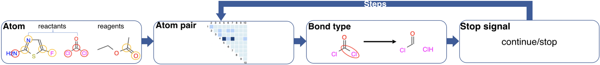
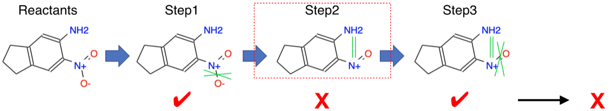
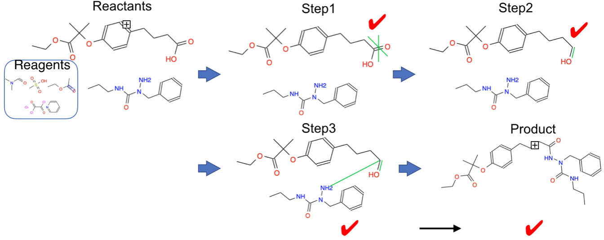

# A GGNN-GWM based step-wise framework for Chemical Synthesis Prediction

## Proposal



The proposed framework contains 4 parts: reacted atom selection, reacted atom pair selection, bond type prediction, stop signal prediction. The reacted atom selection will execute for once, while other 3 parts will execute step-wisely. During each step, only top-1 pair will be selected and the bond type of the selected pair will be predicted. 

The whole step-wise framework was trained end-to-end.

Here are one failed example and one successed example to explain the current step-wise top1 inference metrics:



In this example, reaction stops at step3. Step1 and step3 are same as ground truth but step2 is not, thus this inference is not correct.



In this example, reaction stops at step3. All predicted steps are included in the ground truth regardless of the order, thus this inference is correct.

## Installation

```bash
pip install cupy==6.2.0
pip install chainer==6.2.0
pip install mpi4py
git clone https://github.com/pfnet-research/chainer-chemistry.git && pip install -e chainer-chemistry --no-dependencies
conda install -c rdkit rdkit==2017.09.3.0
```

## Dataset

We used dataset from [https://github.com/connorcoley/rexgen_direct/tree/master/rexgen_direct/data](https://github.com/connorcoley/rexgen_direct/tree/master/rexgen_direct/data)

use train.txt.proc.tar.gz for training

use test.txt.proc.tar.gz for validation and for inference

unzip them to folder 'dataset'

## Usage

```
# use USPTO-400k (all reactions in train.txt.proc) for training:
mpiexec -n 8 python train_framework.py --size 'all' --gwm true --out 'result_all' --pairlr 1e-3 --lr 1e-4 --decay_iter 40000 --batch_size 20 --epoch 300 --gpu --frequency 20 --hdim 50 --nn_hidden_dim 20 --n_layers 2 --concat_hidden false --weight_tying false

# use USPTO-15k (random 15k reactions in train.txt.proc) for training:
mpiexec -n 8 python train_framework.py --size 'normal' --gwm true --out 'result_normal' --pairlr 1e-2 --lr 1e-4 --decay_iter 20000 --batch_size 20 --epoch 1000 --gpu --frequency 20 --hdim 100 --nn_hidden_dim 50 --n_layers 3 --concat_hidden false --weight_tying false 

# use test.txt.proc for inference:
python inference.py --out 'result_all/inference1' --hdim 100 --n_layers 3 --nn_hidden_dim 50 --concat_hidden false --weight_tying false --gwm true --g_stop 'result_all/stop_snapshot_{iteration1}' --g_atom 'result_all/atom_snapshot_{iteration2}' --g_pair 'result_all/pair_snapshot_{iteration3}' --g_action 'result_all/action_snapshot_{iteration4}'

# calculate accuracy:
python acc.py --path 'result_all/inference1_final.txt'
```
